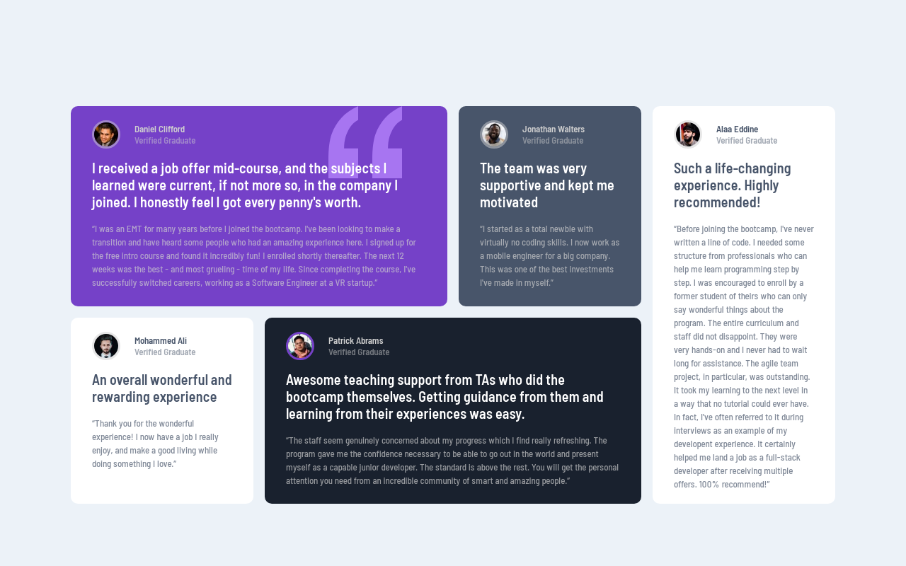

# Frontend Mentor - Testimonials grid section solution

This is a solution to the [Testimonials grid section challenge on Frontend Mentor](https://www.frontendmentor.io/challenges/testimonials-grid-section-Nnw6J7Un7). Frontend Mentor challenges help you improve your coding skills by building realistic projects. 

## Table of contents

- [Overview](#overview)
  - [The challenge](#the-challenge)
  - [Screenshot](#screenshot)
  - [Links](#links)
- [My process](#my-process)
  - [Built with](#built-with)
  - [Useful resources](#useful-resources)
- [Author](#author)

## Overview

### The challenge

Users should be able to:

- View the optimal layout for the site depending on their device's screen size

### Screenshot

### Links

- Solution URL: https://www.frontendmentor.io/solutions/testimonials-grid-section-using-grid-and-flex-box-IHG2TqGujl
- Live Site URL: https://alaa-mekibes.github.io/testimonials-grid-section-frontend-mentor

## My process

### Built with

- Semantic HTML5 markup
- CSS custom properties
- Flexbox
- CSS Grid

### Useful resources

- [px to rem & rpx & vw (cssrem)](https://marketplace.visualstudio.com/items?itemName=cipchk.cssrem) - This helped me for converting px to rem by Moving the cursor to `px` value, press `Alt + z` to convert rem

## Author

- Frontend Mentor - [@alaa-mekibes](https://www.frontendmentor.io/profile/alaa-mekibes)
